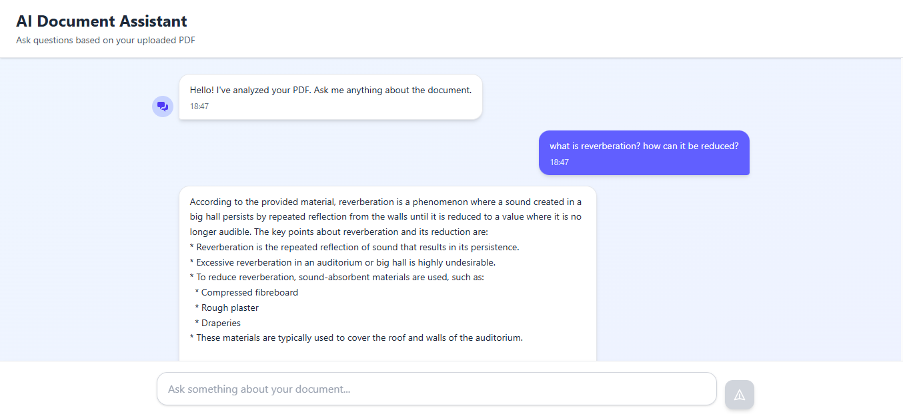

# 🎨 AI Tutor Frontend

Modern, responsive React frontend for the AI Tutor RAG application.

## 📖 Project Overview

The frontend provides an intuitive interface for users to upload PDFs and interact with an AI assistant. Built with React and TypeScript, it features a clean, ChatGPT-like UI with real-time messaging and image display capabilities.

## ✨ Features

### Core Features
- 📤 **Drag & Drop Upload**: Easy PDF file upload with visual feedback
- 💬 **Chat Interface**: Real-time conversation with AI assistant
- 🖼️ **Inline Images**: Display relevant diagrams with answers
- ⚡ **Loading States**: Smooth transitions and loading indicators
- 📱 **Responsive Design**: Works seamlessly on all devices
- 🎨 **Modern UI**: Clean, minimalistic design with Tailwind CSS

### Pages
- **Upload Page** (`/`): PDF upload interface
- **Chat UI** (`/chat/:id`): Interactive Q&A interface

### UI Components
- File upload zone with drag-and-drop
- Message bubbles (user & bot)
- Bot avatar
- Loading animations
- Image display with error handling
- Responsive textarea input

## 📁 Folder Structure

```
client/
├── src/
│   ├── pages/
│   │   ├── Upload.tsx       # File upload page
│   │   └── ChatUI.tsx       # Chat interface
│   ├── App.tsx              # Main app component
│   ├── main.tsx             # Entry point
│   └── index.css            # Global styles
├── public/
├── package.json
└── README.md
```

## 🚀 Installation

### Prerequisites
- Node.js 16.x or higher
- npm or yarn

### Setup Steps

1. **Install Dependencies**
```bash
cd client
npm install
```

2. **Configure Environment**
Create `.env` file:
```env
VITE_API_URL=http://localhost:5000
```

3. **Run Development Server**
```bash
npm run dev
```

4. **Build for Production**
```bash
npm run build
```

## 🔧 Tech Stack

| Technology | Purpose |
|-----------|---------|
| React 18 | UI Framework |
| TypeScript | Type Safety |
| Vite | Build Tool |
| Tailwind CSS | Styling |
| Axios | HTTP Client |
| React Router | Navigation |

## 🌐 API Integration

### Endpoints Used

#### 1. Upload File
```typescript
POST http://localhost:5000/api/uploadFile
Content-Type: multipart/form-data

Body: FormData with 'file' field
```

**Response:**
```json
{
  "success": true,
  "topicId": "id",
  "filename": "document.pdf",
  "imagesExtracted": 5
}
```

#### 2. Chat Query
```typescript
POST http://localhost:5000/api/chat
Content-Type: application/json

Body: {
  "question": "What is sound?",
  "topicId": "id"
}
```

**Response:**
```json
{
  "success": true,
  "answer": "Sound is a vibration...",
  "image": {
    "url": "http://localhost:5000/api/images/uuid/img_001.png"
  },
  "topicId": "id"
}
```

#### 3. Get Image
```typescript
GET http://localhost:5000/api/images/:topicId/:filename
```

### Error Handling

```typescript
try {
  const response = await axios.post(url, data)
  // Handle success
} catch (error) {
  console.error("Error:", error)
  alert('Failed to process request')
  // Reset loading state
}
```

## 🎨 Styling

### Tailwind Configuration
- Gradient backgrounds
- Custom animations (fadeIn, bounce)
- Responsive breakpoints
- Shadow and border utilities

### Custom Animations
```css
.animate-fadeIn {
  animation: fadeIn 0.3s ease-in;
}

@keyframes fadeIn {
  from {
    opacity: 0;
    transform: translateY(10px);
  }
  to {
    opacity: 1;
    transform: translateY(0);
  }
}
```

## 📸 Screenshots

### Upload Page

- Clean upload zone
- Loading spinner during processing
- File name preview

### Chat Interface

- Message bubbles
- Inline images
- Smooth scrolling
- Input area


**Set Environment Variables**
```
VITE_API_URL=https://your-backend-url.com
```


## 🔍 Key Components

### Upload Component
```tsx
// Handles file selection and upload
- Auto-upload on file selection
- Loading states
- Error handling
- Navigation to chat
```

### ChatUI Component
```tsx
// Main chat interface
- Message management
- Real-time updates
- Image display
- Auto-scroll
- Keyboard shortcuts (Enter to send)
```